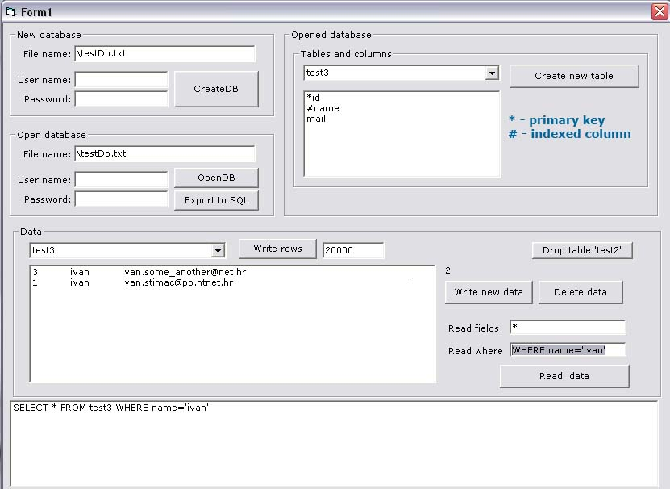



## Small Database Engine 2

### Description

Hi, there is a new version of SmallDBEngine. New version support indexing, and it's much faster (read/delete). Now RecordSet read records from file: MoveNext find pointer to next row and then reads only this row (v.1 reads all records and save them into array, what is slow and use much memory). There is also a class to export whole DB into sql file.

This is only sample project, so don't expect so much from it. You can see one way to create indexing. NOTE: this project support only TEXT fileds (and also only indexing by text, if you want more effective search you must create column data types and create indexing for each data type). I'm created a template for project with custom data types, and I'll create a code when find some time for this.
 
### More Info
 

             |
---                |---
**Submitted On**   |2007-03-17 22:16:18
**By**             |[ivan stimac](https://github.com/Planet-Source-Code/PSCIndex/blob/master/ByAuthor/ivan-stimac.md)
**Level**          |Advanced
**User Rating**    |4.3 (13 globes from 3 users)
**Compatibility**  |VB 6\.0
**Category**       |[Databases/ Data Access/ DAO/ ADO](https://github.com/Planet-Source-Code/PSCIndex/blob/master/ByCategory/databases-data-access-dao-ado__1-6.md)
**World**          |[Visual Basic](https://github.com/Planet-Source-Code/PSCIndex/blob/master/ByWorld/visual-basic.md)
**Archive File**   |[Small\_Data2054393172007\.zip](https://github.com/Planet-Source-Code/ivan-stimac-small-database-engine-2__1-68156/archive/master.zip)

